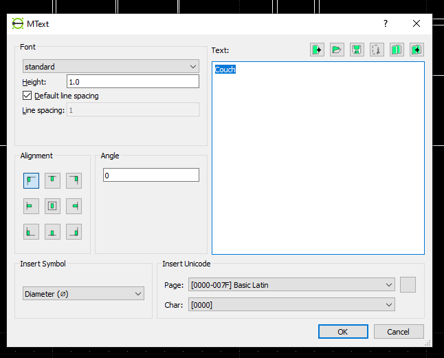

# Drawing a line
When drawing a line you can snap to grid and other things as you might expect in any CAD using these things...

Make sure your document's units are set right in "options > current drawing preferences" such as setting the units to inches or feet. And make sure that dimensions are set to 1 if they aren't 1.

Now, you can draw a line. Using the snapping or not using the snapping, you can draw a say 5 foot line using the following command when your units are set to feet...
```
# This starts the line
line

# This specifies the distance and angle of the line. In this case, 5ft and 0 angle
@5<0
```
The 0 angle and 360 angle will go out to the right. 90 will go up. 180 will go left. 270 will go down.

# Rotating an object
You can rotate an object by clicking on it and typing `rotate` then click again to set the center, click again to set the reference point, then a window will open up where you can specify the angle such as 90.

# Grouping lines and text into objects
You can group objects by selecting them and pressing this button

# Writing on things
You can write on things using this button

A window like this will show up where you can specify the text

# Measuring things
You can measure things using this button

Select two points using the snapping, then unsnap and drag out to have the measurement displayed somewhere.
